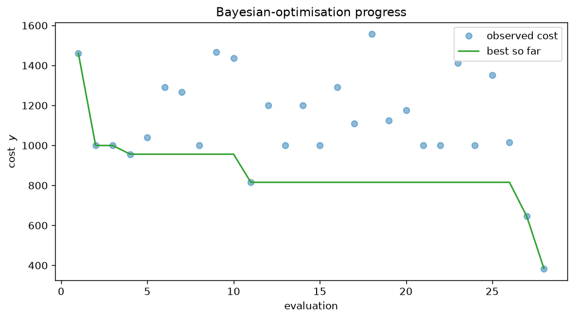
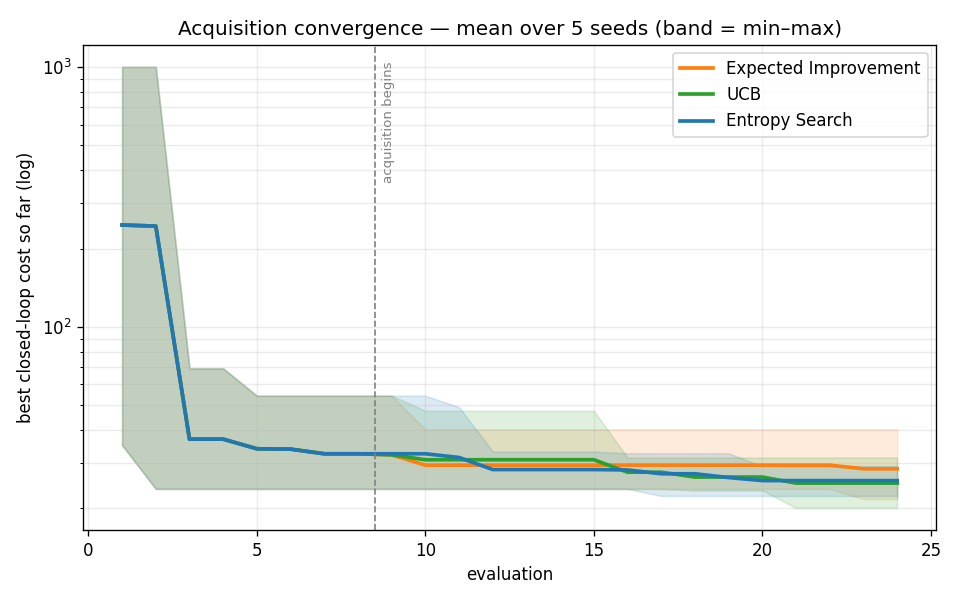

# Hybrid Reaction-Wheel Pendulum

**Automatic tuning of a full LQG controller for an inverted reaction-wheel
pendulum, by Gaussian-process Bayesian optimisation with Entropy Search — every
algorithm written from scratch.** A candidate controller is scored by simulating
the closed loop; the optimiser treats "build the LQG, run it, score the
trajectory" as an expensive black box and searches the weight space for the
design that balances best.

## Relation to prior work

This implements and **extends** Marco, Hennig, Bohg, Schaal & Trimpe, *"Automatic
LQR Tuning Based on Gaussian Process Global Optimization"* (ICRA 2016,
[arXiv:1605.01950](https://arxiv.org/abs/1605.01950)), which tunes LQR weights on
a robot arm with a GP surrogate and Entropy Search. The three deliberate
differences:

| Marco et al. (2016) | This project |
|---|---|
| LQR only — tune `(Q, R)` | full **LQG** — tune `(Q, R)` *and* the Kalman covariances `(W, V)`: an **11-D** search |
| seven-DOF arm + inverted pole | inverted **reaction-wheel pendulum** (the real bench build) |
| hardware experiments as evaluations | seeded, reproducible **simulation rollouts** |
| GP / Entropy Search from research libraries | **everything from scratch** — GP, ML-II, kernels, Entropy Search, Riccati, the lot |

Adding the Kalman filter is the substantive step: it turns the problem from tuning
a state-feedback gain into tuning a full output-feedback estimator+controller,
and — as the robustness study below shows — reintroduces the LQG margin fragility
Marco et al. never had to confront (Doyle 1978).

**Project goals.** (1) implement the LQR + Kalman (LQG) control pipeline and its
theory from first principles; (2) auto-tune its weights by GP Bayesian
optimisation with Entropy Search; (3) bring it to hardware — build, measure,
identify, and balance. Grounded in **CMU 16-745 *Optimal Control*** (Z. Manchester,
[optimalcontrol.ri.cmu.edu](https://optimalcontrol.ri.cmu.edu/)); the acquisition
is from Hennig & Schuler (2012).

## No library that solves the problem

Every numerical algorithm is written from scratch in
[`src/inverted_pendulum/numerics/`](src/inverted_pendulum/numerics/) — Cholesky
and triangular solves, LU, a shifted-QR eigensolver, the matrix exponential,
RK4, the discrete Riccati solver, and a BFGS optimiser. NumPy is used as a
calculator (`@`, broadcasting, slicing, seeded RNG) — never as a solver. SciPy,
scikit-learn, `control`, `filterpy`, GPy and friends appear **only** in
[`tests/validation/`](tests/validation/), as ground truth to check the
hand-written code against. See [`AGENTS.md`](AGENTS.md) and
[`docs/conventions/numerical_standards.md`](docs/conventions/numerical_standards.md).

The rule covers the optimisation layer too: the Gaussian process, the kernels,
the ML-II hyperparameter fit, and Entropy Search itself (representer points,
fantasised observations, the change in the optimum's distribution) are all
implemented here, not imported.

---

## How a tuning run works

1. **Plant.** The nonlinear reaction-wheel pendulum is assembled from a YAML
   config (masses, inertias, motor constants) and linearised about the upright
   equilibrium ([`docs/theory/model.md`](docs/theory/model.md)).
2. **Candidate controller.** A candidate `θ` packs the log-diagonals of `Q, R`
   (LQR weights) and `W, V` (Kalman noise covariances) into an 11-D vector.
   Each candidate becomes a concrete LQG: gain `K` via the discrete Riccati
   equation, filter via the dual DARE
   ([`docs/theory/lqr.md`](docs/theory/lqr.md),
   [`docs/theory/kalman.md`](docs/theory/kalman.md)).
3. **Rollout.** The closed loop runs on the *nonlinear* plant with process and
   measurement noise; the trajectory is scored with one scalar cost — ITAE +
   control energy + hinge penalties on overshoot, settling time, and actuator
   saturation ([`configs/default.yaml`](configs/default.yaml) documents every
   term inline).
4. **Learn and propose.** The GP surrogate is refit by marginal likelihood;
   the acquisition — **Entropy Search** by default, Expected Improvement and
   UCB as baselines — proposes the next `θ`
   ([`docs/theory/optimization.md`](docs/theory/optimization.md)).
5. **Repeat** for a fixed budget (default: 8 Latin-hypercube seeds + 20
   acquisition steps), then report the posterior-mean minimiser and write a
   fully reproducible run record — git hash, config, seed, metrics,
   trajectories, plots.

A run is fully determined by `(config, seed)`: re-running the same config
reproduces the same result.

---

## Architecture

The code is a strict dependency stack — a lower layer never imports an upper
one ([`docs/architecture/dependency_rules.md`](docs/architecture/dependency_rules.md)):

```
numerics → core → physical → dynamics → control ┐
                                        estimation ┘→ simulation → metrics
                                                                 → optimization → experiment
                                                                       io ──────────┘ (leaf)
```

| Layer | What it holds |
|---|---|
| `numerics` | hand-written linear algebra, Riccati, integrators, optimiser, eigensolver |
| `core` | domain value objects (`StateSpaceModel`, `LQGConfig`, `SearchSpace`, `Dataset`, `GPPosterior`, `SimulationResult`) |
| `physical` | `DCMotor`, `ReactionWheel`, `ReactionWheelPendulum` (nonlinear plant + linearisation) |
| `dynamics` | ZOH stepping, linearise-and-discretise, frequency & time response |
| `control` | `LQRController` (gain via the discrete Riccati equation) + `EnergySwingUpController` (the one nonlinear, global law) |
| `estimation` | `KalmanFilter` (predict/update + dual-DARE steady state) |
| `simulation` | `SimulationEngine` — the closed-loop rollout, the optimiser's oracle |
| `metrics` | overshoot, settling time, control effort, trajectory entropy |
| `optimization` | **the heart**: GP surrogate, ML-II, kernels, EI/UCB/**Entropy Search**, the BO loop |
| `experiment` / `io` | config-driven reproducible runs; YAML loading, logging, plotting |

---

## Repository structure

```
├── src/inverted_pendulum/     the package — one directory per layer above
├── configs/                   experiment configurations
│   ├── default.yaml               ← the documented config schema
│   ├── pendulum_sensible.yaml     a realistic bench-scale plant
│   └── pendulum_measured.yaml     the REAL build (CAD + measured parameters)
├── scripts/                   entry points (docs/guides/analysis_scripts.md)
│   ├── run_experiment.py          run one BO tuning experiment end to end
│   ├── two_stage_experiment.py    explore, then warm-started refinement
│   ├── compare_acquisitions.py    Entropy Search vs EI vs UCB benchmark
│   ├── frequency_analysis.py      Bode diagrams of the open-loop plant
│   ├── step_response.py           closed-loop poles & transient metrics
│   ├── stability_margins.py       gain/phase margins of the LQG loop
│   ├── swing_up.py                hanging → upright, then LQG catch
│   ├── evaluation_noise.py        cost-evaluation noise at a fixed controller
│   └── ard_relevance.py           which LQG weights the cost is sensitive to
├── docs/
│   ├── theory/                 the derivations each layer implements
│   ├── guides/                 practical walkthroughs (start here)
│   ├── architecture/           data contracts, dependency rules, class diagram
│   ├── conventions/            numerical standards, the no-library rule
│   ├── hardware/               the physical build: BOM, sensors, sizing, wheel
│   └── papers/                 the inspiration paper + this repo's own analyses
└── tests/
    ├── unit/                   properties of every primitive (no reference libs)
    └── validation/             cross-checks vs SciPy/sklearn/filterpy/control
```

Full documentation is indexed in [`docs/README.md`](docs/README.md); new
readers should start with the
[**codebase overview**](docs/guides/codebase_overview.md).

---

## Installation

No build step — just install the dependencies (a virtual environment is
recommended). Runtime needs only NumPy, PyYAML and matplotlib:

```bash
python -m venv .venv && source .venv/bin/activate   # Windows: .venv\Scripts\activate
pip install -r requirements.txt          # runtime
pip install -r requirements-dev.txt      # + reference libs, to run the tests
```

## Running an experiment

Tests and scripts run with `PYTHONPATH=src` (there is no installed package yet).

```bash
# tune (Q, R, W, V) on the measured build by Entropy Search:
PYTHONPATH=src python scripts/run_experiment.py configs/pendulum_measured.yaml -o results/run01
```

This writes a full, reproducible run record (git hash, config, seed, metrics,
trajectories, convergence and trajectory plots) to `results/run01/`. The
default Entropy-Search budget takes a few minutes; use `--no-plots` or an
Expected-Improvement config for a quick first run. Then analyse the result:

```bash
PYTHONPATH=src python scripts/step_response.py      -o results/transient  # time domain
PYTHONPATH=src python scripts/frequency_analysis.py -o results/bode       # frequency domain
PYTHONPATH=src python scripts/stability_margins.py  configs/pendulum_measured.yaml -o results/margins
PYTHONPATH=src python scripts/compare_acquisitions.py --json results/cmp.json
```

And to run the *full* maneuver — swing up from hanging, then let the LQG catch
and hold it, all on the nonlinear plant:

```bash
PYTHONPATH=src python scripts/swing_up.py configs/pendulum_measured.yaml -o results/swingup
```

The whole workflow — config → run → outputs, determinism, extending — is
covered in [`docs/guides/running_experiments.md`](docs/guides/running_experiments.md);
every script is explained in
[`docs/guides/analysis_scripts.md`](docs/guides/analysis_scripts.md).

## Tests

```bash
PYTHONPATH=src python -m pytest tests/ -q      # 577 tests
```

- `tests/unit/` — properties of each primitive and component (no reference libs).
- `tests/validation/` — the hand-written numerics cross-checked against SciPy /
  scikit-learn / filterpy / python-control to a stated tolerance; the only
  place the banned libraries may be imported.

---

## Results on the measured build

**Tuning convergence.** One run on the real bench plant, Entropy Search, 28
evaluations (8 Latin-hypercube seeds + 20 acquisition steps):



The green staircase is the best closed-loop cost found so far; each blue dot is
one evaluation. The blue scatter *is* the evaluation noise — nominally similar
controllers cost anywhere from ~1000 to ~1560, because every rollout realises
fresh process/measurement noise and a random initial tilt. Note the best design
appears only on the **last** of 28 evaluations: at this budget and dimension the
search is still improving when it stops (see *What we learned*).

**Balancing.** Tuning the real bench plant
([`configs/pendulum_measured.yaml`](configs/pendulum_measured.yaml)) finds an
LQG that stabilises a 0.05 rad tilt in ~0.3 s at a ~7 V peak on the 12 V rail,
in 28 simulated evaluations.

**Robustness, and closing the loop on it.** The follow-up study —
[`docs/papers/robustness_lqg_measured.md`](docs/papers/robustness_lqg_measured.md)
— reads the tuned loop's stability margins and finds it **gain-robust
(6.85 dB, +120 % gain tolerance) but delay-fragile (PM 11.6°, ≈ 57 ms of
latency budget)**: the textbook LQG caveat of Doyle (1978). So the objective
grew an optional **margin penalty** — an asymmetric hinge that fires when phase
or gain margin falls below its floor. Re-running the tuner with it on, all else
identical, **roughly doubles the delay budget (57 → 108 ms, PM 11.6° → 25.2°)**
at a small cost in gain margin. A directional win, not a clean sweep — the
honest A/B, including where it falls short of the 30° target, is §7 of that
paper.

**Swing-up.** [`scripts/swing_up.py`](scripts/swing_up.py) runs the whole
maneuver on the nonlinear plant: energy-shaping swing-up from hanging, a
switching supervisor, then the balancing LQG catching it. On the measured build
it also does the honest thing — it reports the maneuver **infeasible** at the
placeholder pivot friction (`b_p = 0.01` caps the energy pump below what the
0.044 N·m peak reaction torque needs) and names the threshold. Below it, the
pendulum pumps up over ~4 swings and the LQG catches it in 2.82 s to 0.00°.
Theory: [`docs/theory/swingup.md`](docs/theory/swingup.md).

**Entropy Search vs. baselines.** A result compared against a baseline is worth
more than a result alone, so the same tuning problem is run under Entropy Search
and two standard acquisitions — Expected Improvement and UCB — across five seeds
([`scripts/compare_acquisitions.py`](scripts/compare_acquisitions.py),
[`docs/guides/experiments.md`](docs/guides/experiments.md)):

| Acquisition | best cost (mean ± std) | best cost (min) | stabilised* | wall-clock |
|---|---|---|---|---|
| **Entropy Search** | **25.6 ± 2.6** | 22.3 | 80 % | 17.1 s |
| Expected Improvement | 28.4 ± 6.5 | 21.7 | 100 % | 14.5 s |
| UCB | 25.0 ± 3.8 | 20.1 | 60 % | 14.3 s |

<sub>*fraction of seeds whose reported optimum actually stabilises the plant.</sub>



All three share the same seeded initial design (they overlap until the dashed
line), then the acquisition takes over. The min–max bands overlap heavily — a
faithful picture of the table below.

The honest read: **Entropy Search's edge here is consistency, not a lower floor.**
It has the smallest spread across seeds (± 2.6 vs EI's ± 6.5) and beats EI on
the mean, which matches its information-efficient design — but UCB reaches a
marginally lower single-seed best, and *Expected Improvement more often returns a
stabilising controller*. On this low-budget, 11-D problem no acquisition
dominates; Entropy Search buys reliability, at ~20 % more compute.

---

## What we learned

The findings that shaped the project — including the ones that did not go the way
we expected:

- **The cost evaluations are genuinely noisy — a ~20 % coefficient of
  variation.** Re-scoring the tuned controller over 50 seeds
  ([`scripts/evaluation_noise.py`](scripts/evaluation_noise.py)) gives a cost of
  **979 ± 196** (range 362–1213), and that spread is almost entirely
  settling-time scatter (T_s = 8.6 ± 1.4 s, 16 % CV) — the overshoot barely
  moves (2.5 % CV). So the blue scatter in the convergence plot is that noise,
  not exploration, which is *why* the surrogate carries an observation-noise term
  and the reported answer is the posterior-mean minimiser, not the lowest
  observed sample.
- **Not all 11 weights matter — and the pendulum-angle weight isn't one that
  does.** The GP's ARD lengthscales rank how sensitive the cost is to each weight
  ([`scripts/ard_relevance.py`](scripts/ard_relevance.py)). The dominant knobs are
  the LQR weights on the **reaction-wheel states** (`Q·θ̇w`, `Q·θw`) and the
  **control-effort weight `R`**; several weights — including, surprisingly, the
  weight on the pendulum angle itself — come out nearly flat, so the search is
  effectively lower-dimensional than 11-D. A methodological catch came with it:
  on this noisy cost the ML-II fit is **degenerate below ~120 averaged
  evaluations** (it drives `σ_n → 0` and inflates the irrelevant lengthscales to
  ~1e17, interpolating the noise), so the ranking is a budget-hungry *indication*,
  not a precise measurement.
- **The posterior mean, not the best sample, is the right answer — and at this
  budget it is still moving.** The best design showed up on evaluation 28 of 28;
  with an 11-D search and ~28 evaluations, the reported optimum and the luckiest
  observation can differ, and the search has not converged. Small-budget,
  high-dimensional BO is the honest framing of what this tunes.
- **Acquisition choice mattered less than expected.** Entropy Search wins on
  *variance*, not on the best value (table above) — a more sober result than "our
  acquisition is best," and the more useful one.
- **LQG reintroduces a robustness trap that LQR tuning never had (Doyle 1978).**
  The tuner happily returned a controller with an 11.6° phase margin (~57 ms of
  latency budget). Nothing in the cost had asked for robustness — so we added a
  margin penalty, which roughly doubled the delay budget
  ([`docs/papers/robustness_lqg_measured.md`](docs/papers/robustness_lqg_measured.md) §7).
- **The biggest surprise came from hardware.** Measuring the pivot friction gave
  `b_p = 2.7e-4` — **37× smaller** than the placeholder guess — which flips
  swing-up from infeasible to comfortable *and* validates the CAD inertia to 1 %.
  But removing 37× of assumed friction removes 37× of free damping the loop had
  been leaning on: phase margin went **negative** (−21.2°) on every tuning that
  includes the measured pivot-encoder noise. The binding constraint turned out to
  be the **sensor**, not the plant parameters — the kind of thing only a real
  build tells you. The full analysis is
  [`docs/papers/robustness_lqg_identified.md`](docs/papers/robustness_lqg_identified.md).

---

## References

- A. Marco, P. Hennig, J. Bohg, S. Schaal, S. Trimpe, **"Automatic LQR Tuning
  Based on Gaussian Process Global Optimization"**, *IEEE ICRA*, 2016.
  [arXiv:1605.01950](https://arxiv.org/abs/1605.01950) — **the paper this
  project implements and adapts** (LQR → full LQG; robot arm → reaction-wheel
  pendulum; hardware evaluations → seeded simulation rollouts).
- P. Hennig, C. J. Schuler, "Entropy Search for Information-Efficient Global
  Optimization", *JMLR* 13, 2012 — the acquisition function.
- C. E. Rasmussen, C. K. I. Williams, *Gaussian Processes for Machine
  Learning*, MIT Press, 2006 — the GP equations cited throughout the code.
- J. C. Doyle, "Guaranteed Margins for LQG Regulators: None", *IEEE TAC*, 1978
  — why the robustness analysis, and then the margin penalty, exist.
- K. J. Åström, K. Furuta, "Swinging up a pendulum by energy control",
  *Automatica* 36(2), 2000 — the energy-shaping law behind `swing_up.py`.

See [`docs/papers/README.md`](docs/papers/README.md) for how each reference
maps onto the code.
