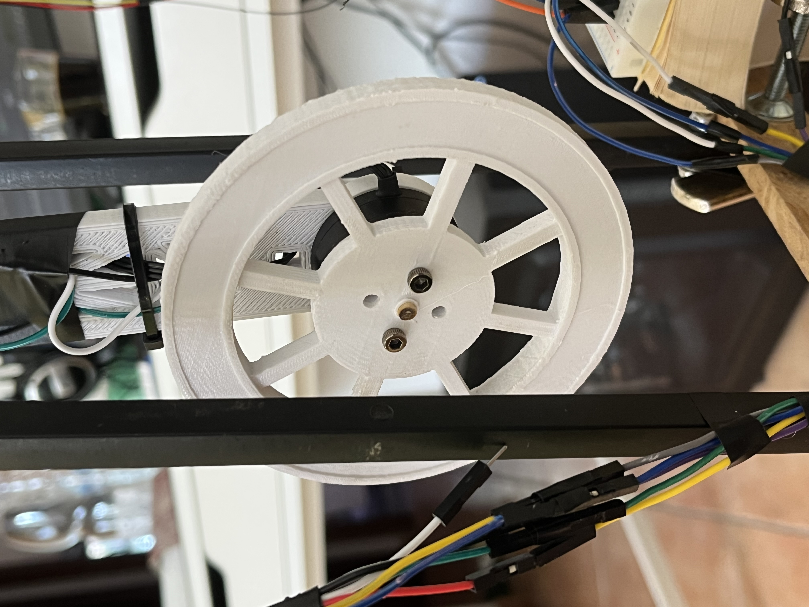
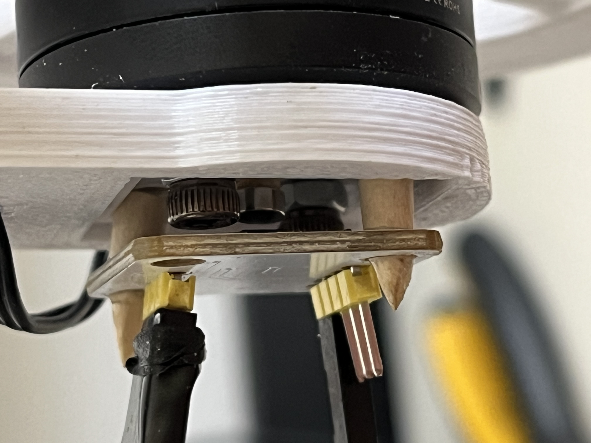
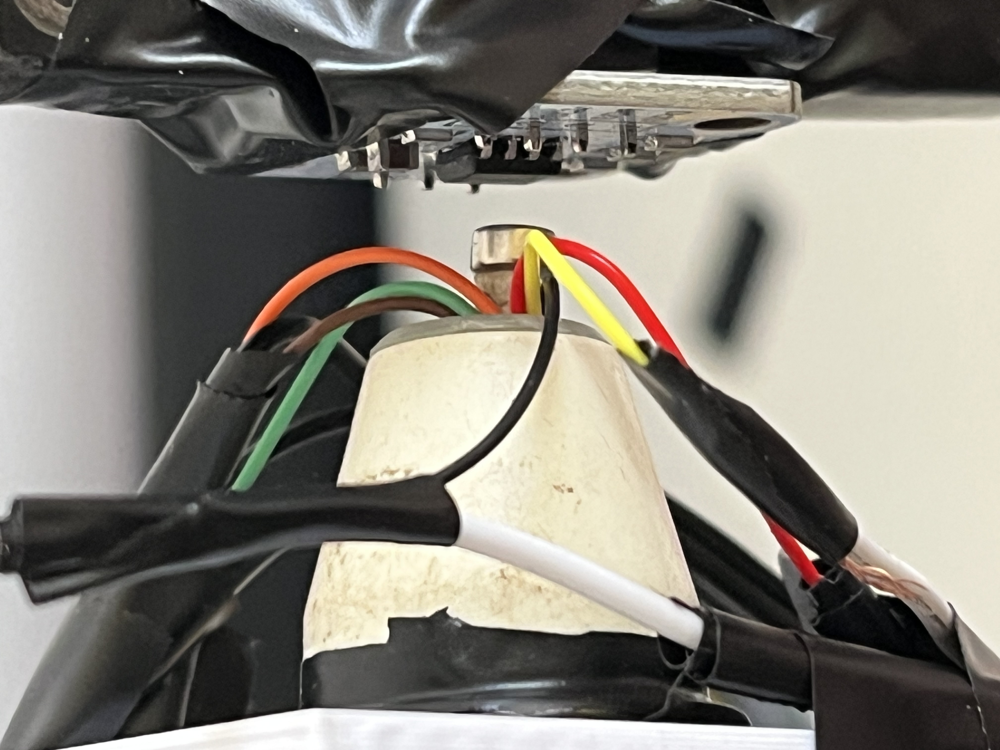
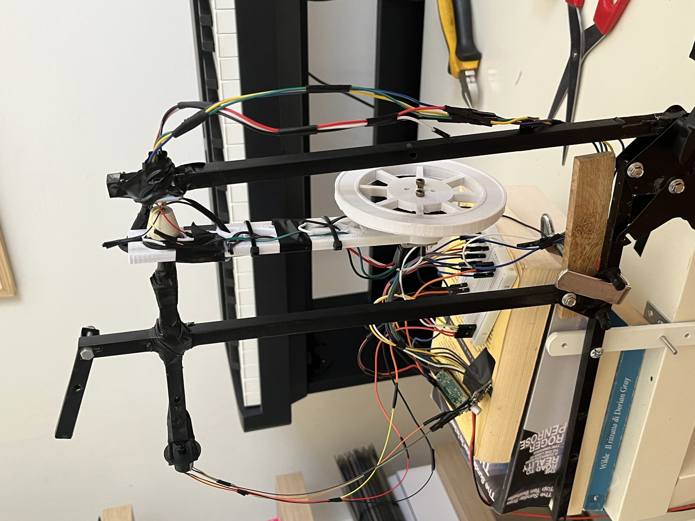

# First build — the as-built bench pendulum (and its problem)

Photos of the first physical build of the reaction-wheel pendulum: the machine
the [identified-plant analysis](../../docs/papers/robustness_lqg_identified.md)
and the [sensor characterisation](../../docs/hardware/sensor_characterisation.md)
are written about.

The pendulum body was designed in CAD (**Onshape**), together with the reaction
wheel ([reaction_wheel_design.md](../../docs/hardware/reaction_wheel_design.md)).

**Current state in one line:** the mechanics and electronics work and the plant
parameters check out against CAD — but the **pivot angle sensor is mounted too
loosely**, and its out-of-plane wobble is now the single thing standing between
this build and a balancing controller.

---

## The reaction wheel and motor

The printed PLA reaction wheel on its brushless motor (GBM2804) — an 8-spoke disc
with the mass concentrated at the rim (the "flywheel" design of
[reaction_wheel_design.md](../../docs/hardware/reaction_wheel_design.md)). As
built it came out lighter than the CAD estimate — `I_w ≈ 6.1e-5 kg·m²`, 41 g —
which is why `configs/pendulum_identified.yaml` supersedes the earlier measured
config.

The motor mount and the **wheel-side** AS5600 encoder (reads the wheel angle
`θ_w`) — bracket-mounted on standoffs. This channel behaves.

---

## The pivot sensor — the problem

This is the **pivot** AS5600 encoder, the one that reads the pendulum angle
`θ_p` — the quantity the whole controller feeds back on. It is held in place by
**electrical tape and a folded paper shim**, not a rigid bracket:

That loose mount is the fault. Because the board and its diametric magnet are not
held rigidly co-axial, any **out-of-plane motion of the arm moves the reading even
when the true pivot angle has not changed** — the encoder reports ±4.6° at a fixed
true angle. Measured on the bench that is a **2.63° (1σ) disturbance on `θ_p`, and
it is not white noise** ([sensor_characterisation.md](../../docs/hardware/sensor_characterisation.md)).

Why it matters, in one sentence: the tuner can only defend against a noisy sensor
by trusting it less, but a filter that trusts the angle less reacts to a real tilt
more slowly, and that slowness is phase lag — so the achievable **phase margin
goes negative (−21.2°)** and the bring-up robustness gate correctly refuses to let
the build attempt balancing. The full argument is in
[robustness_lqg_identified.md](../../docs/papers/robustness_lqg_identified.md).

**The fix is mechanical, not in software.** Next steps, in order:

1. **Redesign the pivot-sensor mount in CAD (Onshape)** *around how sensitive the
   AS5600 is* to air-gap and alignment — a rigid bracket that holds the board and
   its magnet co-axial and kills the out-of-plane wobble at the source.
2. **A stiffer body, more resilient to vibration**, so the arm's oscillation does
   not couple into the sensors as noise.
3. **Swing-up on hardware** — feasible in simulation at the measured `b_p`
   (2.34 s, then the LQG catches it) — once the sensing is fixed.

---

## The complete build

The whole first build on its test frame — pendulum arm with the reaction wheel,
the two encoders, the ESP32/Pico and driver on the breadboard, powered and wired.

More photos of this build are in the folder: `all2.jpeg` (a second full view),
`connections.jpeg` (the breadboard wiring), and `sail_ring.jpeg`.
